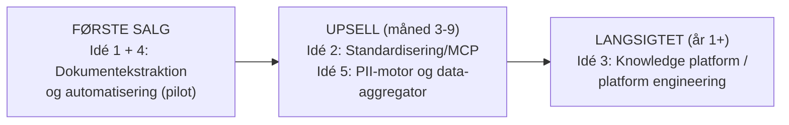

# Ydelser og prioritering — dine 5 idéer gennemgået

> Denne fil gennemgår DINE 5 idéer. Se også `07-markedsdrevne-muligheder.md` for 8 yderligere tilbud, jeg har udledt af markedets faktiske problemer (fejlede AI-pilots, pålidelighed, EU AI Act, legacy-integration m.m.).

Dine idéer fra `spørgsmål.md`, vurderet på: hvor let er det at sælge til en fremmed, hvor hurtigt kan du levere det alene ved siden af et fuldtidsjob, og hvor godt det bygger videre mod de næste salg.

## Samlet anbefaling

Sælg idé 1+4 først. Idé 2 og 5 er naturlige udvidelser hos kunder, der allerede har fået værdi. Idé 3 er et produkt, ikke en freelance-ydelse — den kræver flere kunder med samme behov, før den giver mening.

---

## Idé 1: Dataekstraktion (ustruktureret → struktureret) — SÆLG DENNE FØRST

**Din note**: "trække forskellige data ud fra filer, LlamaIndex for pdf'er og unstructured.io for forskellige filer, integrationer, webscraping og automatisering"

**Vurdering: 5/5.** Det bedste første salg, fordi:

- Smerte, kunden allerede kender og kan sætte kroner på.
- Kort vej fra demo til aftale: du kan vise det på 2 minutter.
- Din egen research peger allerede her (LinkedIn-posten i dine noter siger det præcist: "some of the most valuable AI systems solve much less glamorous problems — processing invoices, extracting information from documents").

**Konkrete use cases at sælge:**

| Use case | Kunde | Værktøjer |
|---|---|---|
| Fakturaer/bilag → økonomisystem | Bogholderi, alle SMV'er | LlamaIndex/LlamaParse eller Azure Document Intelligence + n8n → e-conomic/Dinero API |
| Kontrakter → nøgledata (parter, datoer, beløb, opsigelse) | Ejendom, advokat | LlamaIndex + struktureret output (JSON schema) |
| Rodede filarkiver (PDF/PPT/Excel) → søgbar videnbase | Rådgivere, finans | unstructured.io + vektordatabase |
| Due diligence-dokumentgennemgang | Finans/M&A (jf. dine llamaindex-finance-noter) | Agentic extraction + rapportgenerering |
| Webscraping → strukturerede leads/prisdata | E-commerce, salg | Playwright/Firecrawl + n8n |

**Teknisk stak-anbefaling** (hold den lille): LlamaParse/LlamaIndex til PDF'er, unstructured.io til blandede formater, n8n som orkestrering, struktureret output via JSON schemas, human-in-the-loop-validering i et regneark eller simpelt UI. Byg det samme mønster igen og igen — det er dér, marginen kommer fra.

## Idé 4: Automatisering af emails, bilag og form-filling — SÆLG SAMMEN MED IDÉ 1

**Din note**: "Fikse emails og bilag osv, form-filling af dokumenter"

**Vurdering: 5/5.** Det er reelt samme salg som idé 1 — input er bare en email-indbakke i stedet for en filmappe. Tilsammen udgør idé 1+4 dit "Document AI Pilot"-tilbud:

- Indgående email med bilag → klassificér → udtræk → journalisér/bogfør.
- Form-filling: kundens data → automatisk udfyldte standarddokumenter (kontrakter, ansøgninger, rapporter). CopilotKits "Form Filling Copilot" fra dine noter er et godt UI-mønster, hvis kunden vil have en chat-oplevelse oven på.

## Idé 2: Standardisering og centralisering af prompts/workflows (MCP) — UPSELL

**Din note**: "medarbejderen skal ikke lave samme prompt og automatisering selv; MCP; workflows med brugerkonfigurerede prompts"

**Vurdering: 3/5 som første salg, 5/5 som upsell.** Problemet er reelt (alle medarbejdere genopfinder deres egne prompts), men:

- En fremmed SMV køber ikke "MCP-standardisering" — de ved ikke, de har problemet, før de har brugt AI et stykke tid.
- EFTER en pilot er det derimod et oplagt næste skridt: "I har nu 3 workflows — skal vi samle dem, så hele teamet kan bruge dem ensartet?" Det er dit abonnementsprodukt (pakke 2 i forretningsplanen).

Positionér det som "AI-fundament for teamet", ikke som MCP/teknologi.

## Idé 5: PII-motor og data-aggregator — UPSELL / DIFFERENTIATOR

**Din note**: "PII centralmotor og data-aggregator (agent node i workflows) så medarbejdere bare kan uploade ting og bagefter lave AI på det"

**Vurdering: 3/5 som selvstændigt salg, men stærk som indbygget feature.** PII-håndtering (anonymisering/maskering før data rammer en LLM) er:

- Et krav, ikke et produkt, for de fleste SMV'er — men et **stærkt salgsargument** kombineret med din Compliance-service: "Jeres data renses for personoplysninger, før de rammer AI-modellen."
- Byg det som en genbrugelig node/komponent i dine egne workflows fra pilot #1. Så bliver det en differentiator i alle salg ("GDPR-sikret pipeline") uden at være et separat produkt, du skal sælge.

Hos større kunder (finans, forsikring, ejendom) kan det senere sælges som selvstændigt projekt.

## Idé 3: Knowledge platform / platform engineering (Claude Code, n8n, MCP i en web-app) — LANGSIGTET

**Din note**: "platform hvor medarbejderen kan bruge Claude Code og n8n og MCP — jeg bygger en knowledge base app/platform"

**Vurdering: 2/5 nu, potentielt stort senere.** Ærligt: det her er et **produkt**, ikke en freelance-ydelse, og produkter kræver:

- Måneders udviklingstid uden betaling (du har 8-10 timer/uge).
- Flere kunder med præcis samme behov — som du først opdager efter 5-10 leverede projekter.
- Konkurrence fra velfinansierede spillere (Dust, Glean, Copilot Studio, n8n selv).

**Det rigtige træk**: Lever idé 1+4-projekter, og læg mærke til hvad du bygger igen og igen. Efter 5+ kunder VED du, hvad platformen skal kunne — og du har kunder at sælge den til fra dag 1. Indtil da: byg din egen interne værktøjskasse (skabelon-workflows, PII-node, ekstraktions-pipelines), som reelt er platformens v0.

---

## Svar på dine to direkte spørgsmål

**"Hvad synes du, jeg skal lægge vægt på?"**
Ét tilbud: dokument-/dataautomatisering (idé 1+4) som fastpris-pilot. Alt andet er upsell eller senere. Din brede service-palet på sitet er fin som bagkatalog, men før med det skarpe tilbud.

**"Hvad tror du, folk er mest interesseret i?"**
Sparede timer på kedelig administration. Konkret: bilag, fakturaer, kontrakter og formularer. Ingen kunder er interesserede i RAG, MCP eller agents — de er interesserede i "6 timer om ugen, der forsvinder". Vis det med demoer i stedet for at forklare teknologien, så er du foran 90 % af dem, der poster om AI.
