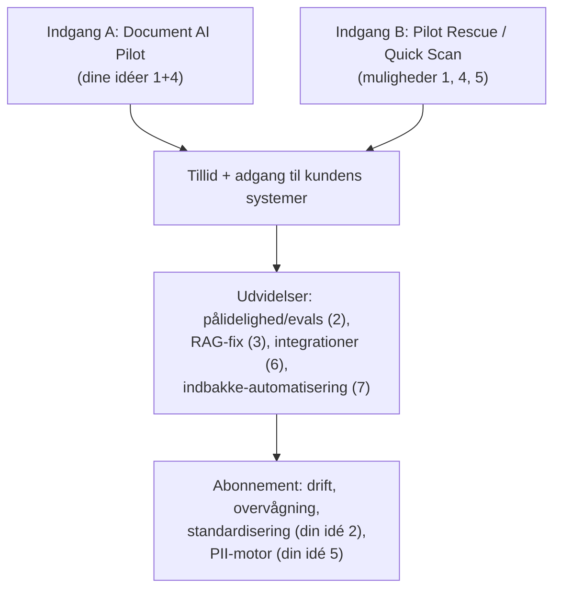

# Markedsdrevne muligheder — hvad firmaer faktisk kæmper med

> Denne fil er IKKE baseret på dine egne idéer, men på de problemer virksomheder reelt har med AI, automatisering og software lige nu — mappet til de 7 services på din hjemmeside. Brug den som idébank til tilbud, content-emner og outreach-vinkler.

## Det store billede

Markedet har flyttet sig fra "vi vil have AI" til "vores AI virker ikke". De fleste virksomheder har nu prøvet noget — ChatGPT-licenser, en chatbot-POC, et hackathon — og størstedelen af de projekter er aldrig kommet i produktion eller har skuffet. Det er en kæmpe mulighed for en praktiker som dig: **du behøver ikke overbevise nogen om AI — du skal fikse det, de allerede har fejlet med.**

De 8 muligheder herunder er sorteret efter, hvor godt de passer til dig lige nu.

---

## 1. "AI Pilot Rescue" — red den strandede POC (AI Engineering)

**Problemet i markedet**: Langt de fleste GenAI-pilots når aldrig i produktion. Typiske årsager: demoen virkede på 10 dokumenter men ikke på 10.000, ingen håndterede fejltilfælde, ingen ejede projektet efter konsulenten/praktikanten forsvandt, eller svarene var for upålidelige til rigtige brugere.

**Dit tilbud**: Fast-pris audit (fx 10.000 kr): gennemgå deres strandede POC, identificér hvorfor den ikke er i produktion, levér en konkret plan — og tilbyd at bygge den færdig. 

**Hvorfor dig**: Din positionering "You review. I handle the rest." er præcis modgiften mod den ejerskabsløshed, der dræbte deres projekt.

**Outreach-hook**: *"Har I en AI-pilot fra sidste år, der aldrig kom i drift? Det er der en grund til — og den kan som regel fikses på 2-4 uger."*

## 2. Pålidelighed og evals — "chatbotten svarer forkert" (AI Engineering)

**Problemet i markedet**: Virksomheder med AI i drift tør ikke stole på den. De har ingen systematisk måling af svar-kvalitet, ingen regression-tests når de skifter model/prompt, og ingen alarm når kvaliteten falder. Det her er dét, der adskiller demo fra produktion — og næsten ingen SMV'er har kompetencen internt. (Din egen note siger det samme: "En demo er let. Men rigtige applikationer skal være nøjagtige og konsistente.")

**Dit tilbud**: "AI Reliability Check" — opsæt eval-suite (fx med LangSmith/Langfuse eller simple golden datasets), mål baseline, forbedr prompts/retrieval, og efterlad kunden med et dashboard og en test-rutine.

**Hvorfor dig**: Dine noter om "Improving Accuracy of LLM Applications" peger allerede her. Det er også et naturligt tillæg til enhver pilot, du selv leverer — og et abonnementsprodukt (løbende overvågning).

## 3. RAG der faktisk finder det rigtige — intern videnssøgning 2.0 (AI Engineering)

**Problemet i markedet**: Mange firmaer har bygget "chat med vores dokumenter" og opdaget, at den ikke finder de rigtige ting: dårlig chunking, forældede dokumenter, ingen adgangsstyring, ingen kildehenvisninger. Medarbejderne prøvede den to gange og gik tilbage til at spørge kollegaen.

**Dit tilbud**: RAG-genopretning: dokument-oprydning og struktur (her genbruger du hele din ekstraktions-værktøjskasse), bedre retrieval (hybrid søgning, metadata, evt. grafdatabase som i dine noter), kildehenvisninger og evals.

**Kombination**: Dette er reelt din idé 1 + mulighed 2 pakket som et "fiks jeres eksisterende system"-salg i stedet for et "byg nyt"-salg — lavere barriere, fordi budgettet allerede er brugt én gang og smerten er bevist.

## 4. EU AI Act + AI-governance readiness (Compliance)

**Problemet i markedet**: EU AI Act's forpligtelser rulles ud nu, og de fleste SMV'er aner ikke, om deres AI-brug er "høj-risiko", hvad de skal dokumentere, eller hvilke krav der gælder AI-systemer de køber. Samtidig bruger medarbejdere ChatGPT i det skjulte med kundedata ("shadow AI") — et GDPR-mareridt ledelsen ikke har overblik over.

**Dit tilbud**: "AI Compliance Quick Scan" (fast pris): kortlæg al AI-brug i virksomheden, klassificér efter AI Act-risikoniveau, identificér GDPR-huller (inkl. shadow AI), levér politik + handlingsplan. Upsell: implementering af sikre alternativer (godkendte værktøjer, PII-maskering — din idé 5 passer perfekt her).

**Hvorfor dig**: Du har allerede IT Compliance som service på sitet (Azure-orienteret, GDPR, audits). Kombinationen "kan bygge AI OG har styr på compliance" er sjælden og meget dansk-venlig — danske virksomheder er notorisk forsigtige.

## 5. AI-enablement: "vi betaler for Copilot, men ingen bruger det" (Automation + AI)

**Problemet i markedet**: Virksomheder har købt ChatGPT Team/Copilot-licenser til alle — og ser næsten ingen effekt. Medarbejderne mangler konkrete, rollespecifikke workflows, og hver medarbejder genopfinder dårlige prompts (præcis din idé 2, men her er den markedsvaliderede indgang til den).

**Dit tilbud**: Workshop + implementering: kortlæg 3-5 tidsslugende opgaver pr. afdeling, byg konkrete assistenter/workflows til dem (skabeloner, custom GPTs, n8n-flows), og mål tidsbesparelsen efter 30 dage.

**Hvorfor det virker som salg**: Budgettet ER allerede brugt (licenserne) — du sælger "få værdi ud af det, I allerede betaler for". Det er en af de letteste B2B-samtaler, der findes, og den fører direkte videre til dine automatiserings- og standardiseringsydelser.

## 6. Legacy-integration: systemer der ikke taler sammen (Third-Party Tech + Automation)

**Problemet i markedet**: SMV'ens data bor i et gammelt ERP, et branchesystem uden API, Excel-ark og en tilfældig Access-database. Enhver AI- eller automatiseringsdrøm strander på, at data ikke kan komme ud. Store konsulenthuse vil ikke røre det under 500.000 kr.

**Dit tilbud**: Integrationsbro i lille skala: udtræk via API hvor muligt, robot-udtræk/scraping hvor ikke (dine webscraping-kompetencer), n8n som lim, og et centralt "rent" datalag (fx Postgres/Supabase). 

**Hvorfor dig**: Det er dét, din Third-Party Tech-service handler om — og det er den infrastruktur, alle dine andre ydelser står ovenpå. Kunder der køber det her, køber typisk mere.

## 7. Kundeservice- og indbakke-automatisering (Automation + AI)

**Problemet i markedet**: Fælles-indbakken (info@/support@) er SMV'ens flaskehals: samme 20 spørgsmål igen og igen, langsom svartid, viden der kun bor i én medarbejders hoved. Det er den mest efterspurgte konkrete AI-automatisering hos små virksomheder overhovedet.

**Dit tilbud**: Email-triage + udkast-generering: klassificér indgående mails, besvar de rutinemæssige automatisk (med human review — dit "You review"-brand igen), routér resten med foreslået svar-udkast. Byg på kundens egen viden (RAG over deres FAQ/dokumenter).

**Kombination**: Ligger tæt op ad din idé 4 (emails/bilag) — men vinklen "svar hurtigere på kundehenvendelser" sælger på omsætning (gladere kunder), ikke kun på sparede timer. To forskellige knapper at trykke på i outreach.

## 8. AI-MVP'er for ikke-tekniske founders (MVPs & Launch)

**Problemet i markedet**: Bølgen af founders med en AI-produktidé men ingen teknisk medstifter er enorm. De er blevet lovet guld af no-code/vibe-coding-værktøjer og står med noget, der ikke kan skaleres, ikke er sikkert, og ikke kan vedlikeholdes.

**Dit tilbud**: Fast-pris AI-MVP (fx 40.000-75.000 kr): validering, scoping, byg med produktionsklar stak (Next.js + Supabase — din egen stak), inkl. evals og deployment. Eller mindre: "MVP-redning" af deres vibe-kodede prototype.

**Forbehold**: Founders har ofte flere drømme end penge, og salget er sværere at systematisere end SMV-automatisering. Behold det som opportunistisk sidespor (det står allerede på sitet), ikke som fokus.

---

## Hvordan det spiller sammen med din kerneplan

- **Dit spydspidstilbud ændrer sig ikke** — Document AI Pilot er stadig det letteste første salg. Men mulighed 1, 4 og 5 er alternative *indgange* til kunder, der allerede har brugt penge på AI: de har bevist budget og smerte, og "fiks det" er et lettere salg end "start noget nyt".
- **Content**: Hver mulighed herover er 2-3 LinkedIn-posts (fx "Why most AI pilots never reach production — and the 3 fixes I see work", "Your team has Copilot licenses. Here's why nothing changed."). Flet dem ind i kalenderen i `03-content-strategi.md` fra uge 5.
- **Outreach**: Brug mulighed 1/4/5-hooks til virksomheder, hvor du kan se AI-aktivitet (jobopslag med "AI", LinkedIn-posts om deres pilots, presseomtale) — og Document AI Pilot-hooket til resten. Se `05-cold-outreach.md`.
- **Prisstruktur**: Muligheder 1, 2 og 4 er audits/scans (10.000-15.000 kr fast pris) — lav risiko for kunden, og de producerer ALTID en opgaveliste, som du naturligt er førstevalg til at løse.
