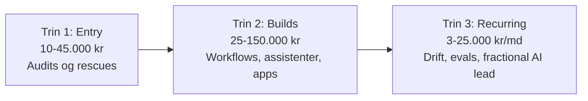

# Tilbudskatalog og priser — tværfaglig AI engineering / automatisering / software

> Researchbaseret katalog over hvad du kan sælge og til hvilken pris. Benchmarks: uafhængige AI-konsulenter tager i 2026 typisk 150-350 USD/t (~1.000-2.300 kr/t); pakkepriser tjener ~2,3x mere end timepris for de samme timer. Danske SMV'er ligger i den lave ende af intervallerne; internationale/finansierede kunder i den høje.

## Hvorfor kataloget ser sådan ud

Research i hvorfor virksomheders AI-projekter fejler viser et konsistent mønster: **det er næsten aldrig modellen — det er alt omkring den.** Pilots der ikke er integreret i ERP/CRM/workflows, fragmenteret data, governance der kommer for sent ind, ingen evals/observability, og uklare ROI-mål. ~95 % af AI-pilots giver ikke ROI (MIT), og Gartner forventer at 60 % af AI-projekter opgives pga. manglende AI-klar data.

Det er præcis dér, din tværfaglige profil er guld værd: du kan både AI-laget (RAG, agents, evals, ekstraktion) OG software-laget omkring det (integrationer, backend, webapps, drift). Kataloget er bygget som en **trappe**: billige entry-tilbud der er lette at sige ja til → builds → tilbagevendende omsætning.

---

## Trin 1: Entry-tilbud (fast pris, 10.000-45.000 kr)

Formål: lav beslutningsbarriere, hurtig levering, producerer ALTID en opgaveliste du er førstevalg til at løse. Benchmark: "AI Opportunity Audit"-pakker handles internationalt til 3.500-6.500 USD; readiness-audits op til 25.000 USD hos større kunder.

### 1.1 AI & Automation Opportunity Audit — 15.000-35.000 kr, 1-2 uger

- **Smerte**: "Vi ved AI er vigtigt, men aner ikke hvor vi skal starte." (Den mest udbredte tilstand i SMV-markedet.)
- **Leverance**: Workflow-kortlægning af 1-3 afdelinger, ROI-ranket liste over automatiseringsmuligheder, anbefalet stak, 90-dages roadmap med prisestimater. Ledelses-klar opsummering.
- **Køber**: Direktør/COO i SMV (10-200 ansatte).
- **Upsell**: Byg top-prioriteten (trin 2).

### 1.2 AI Pilot Rescue — 12.000-25.000 kr, 1-2 uger

- **Smerte**: "Vi lavede en AI-POC sidste år. Den ligger stadig i en sandbox." Årsagen er typisk manglende integration, fejlhåndtering eller pålidelighed — ikke modellen.
- **Leverance**: Teknisk gennemgang af den strandede pilot, rodårsagsanalyse, konkret produktionsplan med estimat. Evt. fastpris-tilbud på selve færdiggørelsen.
- **Køber**: Virksomheder med synlig AI-aktivitet (jobopslag, LinkedIn-posts om deres pilot).
- **Upsell**: Færdiggørelsen (trin 2) + evals/drift (trin 3).

### 1.3 AI Reliability & Evals Check — 15.000-30.000 kr, 1-2 uger

- **Smerte**: "Chatbotten/assistenten svarer nogle gange forkert, og vi tør ikke rulle den bredere ud." Ingen måler kvaliteten systematisk.
- **Leverance**: Eval-suite på kundens use case (golden dataset, automatiske tests), baseline-måling, konkrete forbedringer af prompts/retrieval, dashboard + testrutine kunden selv kan køre.
- **Køber**: Alle med LLM-features i drift — også bureauer/softwarehuse der har bygget noget for deres kunder.
- **Upsell**: Løbende kvalitetsovervågning (trin 3).

### 1.4 Automation Cleanup Audit — 10.000-20.000 kr, 1 uge

- **Smerte**: "Vi har 30 Zapier/Make/n8n-flows bygget af en der er stoppet. Ingen ved hvad der kører, og ting fejler i stilhed."
- **Leverance**: Kortlægning af alle flows, fejl- og risikoanalyse, konsolideringsplan, dokumentation.
- **Køber**: SMV'er der har automatiseret ad hoc i 2-3 år.
- **Upsell**: Konsolidering + drift-abonnement.

### 1.5 AI Compliance Quick Scan (GDPR + EU AI Act) — 15.000-35.000 kr, 1-2 uger

- **Smerte**: Shadow AI (medarbejdere bruger ChatGPT med kundedata), uklarhed om AI Act-forpligtelser, ingen politikker.
- **Leverance**: Kortlægning af al AI-brug, risikoklassificering, GDPR-gap-analyse, AI-politik + handlingsplan. Benchmark: governance-frameworks handles til ~15.000 USD internationalt.
- **Køber**: Especially finans, ejendom, advokat, sundhed — og alle med bestyrelse der spørger.
- **Upsell**: Implementering af sikre alternativer, PII-maskering, governance-as-a-service (3-5.000 kr/md).

---

## Trin 2: Build-tilbud (fast pris, 25.000-150.000 kr)

Formål: kerneomsætningen. Benchmark: "Pilot Workflow Build" handles til 8.500-14.000 USD (~55-90.000 kr); interne RAG-assistenter 22.000-45.000 USD (~140-300.000 kr) — danske SMV-priser ligger lavere, deraf intervallerne. SMV-custom-builds generelt: 2.000-25.000 USD. Alle builds sælges med succesmetrik og human-in-the-loop som feature.

### 2.1 Dokument- og datapipeline — 25.000-75.000 kr, 2-5 uger

- **Smerte**: Manuel indtastning fra PDF'er, emails, formularer, rapporter. Den mest udbredte og letteste at sælge (payback 30-90 dage).
- **Leverance**: Ustruktureret → struktureret: modtag → udtræk → validér (human review) → aflever i kundens system. Inkl. dokumentation og træning.
- **Varianter**: fakturaer/bilag → økonomisystem; kontrakter → nøgledata; formular-udfyldning; dokumentindsamling med automatisk rykning.

### 2.2 Indbakke- og kundekommunikations-automatisering — 30.000-80.000 kr, 3-5 uger

- **Smerte**: Fællesindbakken er flaskehalsen: samme 20 spørgsmål, langsom svartid. Kundekommunikation er den mest udbredte SMV-automatiseringskategori i 2026.
- **Leverance**: Klassificering af indgående henvendelser, automatiske svar på rutinespørgsmål (RAG på kundens egen viden), udkast + routing på resten, opfølgnings-/reminder-sekvenser.
- **Sælges på**: både sparede timer OG hurtigere svartid = mere omsætning.

### 2.3 Faktura/AR- og afstemnings-flows — 30.000-90.000 kr, 3-6 uger

- **Smerte**: Finansprocesser har den hurtigste dokumenterede AI-ROI (20-30 % omkostningsreduktion iflg. McKinsey): fakturabehandling, betalingsrykkere, bankafstemning, udgiftskodning.
- **Leverance**: End-to-end flow integreret med økonomisystemet (e-conomic/Dinero/QuickBooks m.fl.), med audit-trail og godkendelsestrin.
- **Køber**: Økonomichefer, bogholderi- og regnskabsfirmaer (som kan gensælge til alle deres kunder).

### 2.4 Intern AI-assistent på virksomhedsdata (RAG) — 50.000-150.000 kr, 4-8 uger

- **Smerte**: Viden spredt i SharePoint/Drive/mails; nyansatte spørger de samme spørgsmål; eksisterende "chat med vores docs"-løsninger finder ikke de rigtige svar.
- **Leverance**: Dataoprydning + pipeline (din ekstraktions-værktøjskasse), retrieval der virker (hybrid søgning, metadata, adgangsstyring), kildehenvisninger, evals fra dag 1, hosting og overvågning.
- **Differentiator**: De fleste sælger demoen; du sælger den med målt kvalitet og drift.

### 2.5 Integrationsbro / legacy-systemer — 40.000-120.000 kr, 4-8 uger

- **Smerte**: Data fanget i gammelt ERP/branchesystem uden API. Enhver AI-drøm strander her ("disconnected pilot" er fejlmønster nr. 1 i enterprise). Store huse rører det ikke under ½ mio.
- **Leverance**: API hvor muligt, browser-automatisering/scraping hvor ikke, centralt rent datalag (Postgres/Supabase), n8n/custom services som lim.
- **Strategisk værdi**: Kunden der køber det her, køber typisk 2-3 projekter mere — du ejer nu datafundamentet.

### 2.6 Agent-workflow med human-in-the-loop — 50.000-150.000 kr, 4-8 uger

- **Smerte**: Flertrins-processer (sagsbehandling, tilbudsgenerering, onboarding, lead-kvalificering) hvor ren automatisering er for stiv og ren AI for upålidelig.
- **Leverance**: Orkestreret agent-flow (LangGraph/n8n) med definerede godkendelsespunkter, logging, fejlhåndtering og eskalering. HITL selektivt — som kvalitetsgreb, ikke flaskehals.
- **Eksempler**: lead ind → berig → kvalificér → udkast til svar → CRM; ordre ind → tjek lager → bekræft → fakturér.

### 2.7 Custom webapp / internt værktøj — 40.000-150.000 kr, 4-10 uger

- **Smerte**: Forretningskritisk proces kører i Excel + mails; hyldevarer passer ikke.
- **Leverance**: Fullstack-app (Next.js/React + backend), gerne med AI-features indbygget (parsing, søgning, copilot-UI). Tests, dokumentation, deployment.
- **Din edge**: AI-freelancere kan ikke bygge rigtig software; softwarefolk kan ikke AI-laget. Du kan begge.

### 2.8 MVP for startups/founders — 50.000-150.000 kr, 4-8 uger

- **Smerte**: Founder uden teknisk medstifter; evt. en vibe-kodet prototype der ikke kan skaleres eller sikres.
- **Leverance**: Scoping → produktionsklar MVP (din egen stak) inkl. auth, betaling, evals på AI-features, deployment. Eller "MVP-redning" af eksisterende prototype (25-60.000 kr).
- **Forbehold**: Opportunistisk, ikke fokus — founders har ofte flere drømme end penge.

---

## Trin 3: Tilbagevendende omsætning (3.000-25.000 kr/md)

Formål: forudsigelig indtægt + fastholdelse. Benchmark: automation-ops/optimerings-retainere og fractional AI leadership handles internationalt til 4.000-25.000 USD/md; dansk SMV-niveau er lavere.

### 3.1 Drift & overvågning af workflows — 3.000-8.000 kr/md

Alt du bygger i trin 2 tilbydes med drift: overvågning, fejlhåndtering, småjusteringer, månedlig rapport. Standard-upsell på HVERT build — sig det allerede i tilbuddet.

### 3.2 Kvalitets-/evals-overvågning af AI-systemer — 4.000-10.000 kr/md

Løbende eval-kørsler, drift-detektion når modeller/data ændrer sig, månedlig kvalitetsrapport. Naturlig fortsættelse af 1.3 og 2.4.

### 3.3 Automation Ops-retainer — 8.000-15.000 kr/md

Fast antal timer/md til løbende nye automatiseringer og forbedringer. For kunder efter 2-3 leverede projekter. Inkluderer standardisering på tværs af teamet (delte prompts, genbrugelige workflows — MCP hvor det giver mening).

### 3.4 Fractional AI Lead — 12.000-25.000 kr/md (1-2 dage/md-uge)

Roadmap-ejerskab, værktøjs-/leverandørvalg, governance, sparring med ledelsen. For SMV'er/startups der har brug for AI-ledelse men ikke kan retfærdiggøre en fuldtidsansættelse. OBS: kræver kalendertid — realistisk først når freelancen er din hovedbeskæftigelse, eller i mini-format (½ dag/md, 5-8.000 kr).

---

## Prisprincipper

1. **Fast pris frem for timer.** Research viser package-pricing tjener ~2,3x mere for samme timer — og kunder hader åbne timeregninger. Timepris (900-1.400 kr/t dansk niveau, mere internationalt) kun til småopgaver og ændringer udenfor scope.
2. **Succesmetrik i hvert tilbud.** "95 % korrekt udtræk", "svartid under 1 time", "X timer sparet/md". Det differentierer dig fra alle der sælger vag "AI-rådgivning" — og gør genkøb selvsagt.
3. **Performance-bonus som option.** Fx fast pris + bonus hvis KPI nås inden 90 dage. Signalerer selvtillid, og benchmarks viser det bruges aktivt i markedet (fx 12.000 USD + 3.000 USD bonus).
4. **Ankr med kundens regnestykke, ikke dine timer.** En proces der koster 60-90.000 kr/år i løn gør et 40.000 kr-build billigt. Payback under 6 måneder er sætningen der lukker.
5. **International prissætning.** Samme leverance tåler 30-80 % højere pris hos internationale/VC-finansierede kunder. Dit engelske brand er bygget til det — underbyd ikke dig selv dér.
6. **Rabat-regel.** Aldrig rabat uden modydelse: kortere beslutningsfrist, case-tilladelse, eller reduceret scope.

## Hurtigt overblik

| Tilbud | Pris | Varighed | Sværhedsgrad at sælge |
|---|---|---|---|
| Opportunity Audit | 15-35.000 kr | 1-2 uger | Let |
| Pilot Rescue | 12-25.000 kr | 1-2 uger | Let (hvis signal findes) |
| Reliability/Evals Check | 15-30.000 kr | 1-2 uger | Middel |
| Automation Cleanup | 10-20.000 kr | 1 uge | Let |
| Compliance Quick Scan | 15-35.000 kr | 1-2 uger | Middel |
| Dokument/datapipeline | 25-75.000 kr | 2-5 uger | Let |
| Indbakke-automatisering | 30-80.000 kr | 3-5 uger | Let |
| Faktura/AR/afstemning | 30-90.000 kr | 3-6 uger | Let |
| Intern RAG-assistent | 50-150.000 kr | 4-8 uger | Middel |
| Legacy-integrationsbro | 40-120.000 kr | 4-8 uger | Middel |
| Agent-workflow m. HITL | 50-150.000 kr | 4-8 uger | Middel |
| Custom webapp | 40-150.000 kr | 4-10 uger | Middel |
| MVP-build | 50-150.000 kr | 4-8 uger | Middel/svær |
| Drift & overvågning | 3-8.000 kr/md | løbende | Let (efter build) |
| Evals-overvågning | 4-10.000 kr/md | løbende | Middel |
| Automation Ops-retainer | 8-15.000 kr/md | løbende | Let (efter 2-3 builds) |
| Fractional AI Lead | 12-25.000 kr/md | løbende | Svær (kræver tid/tillid) |

**Praktisk brug**: Vælg 1-2 entry-tilbud + 2-3 builds som dem, du aktivt markedsfører. Resten er kataloget, du trækker frem, når samtalen peger derhen. Hvert tilbud har tilhørende content-vinkler i `09-content-idebank.md`.
